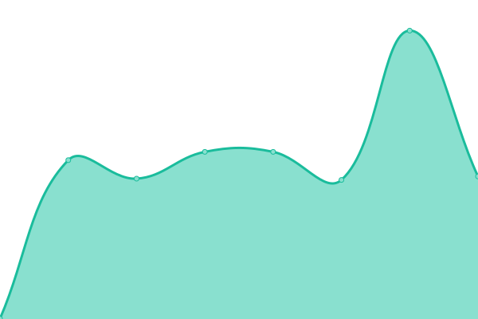
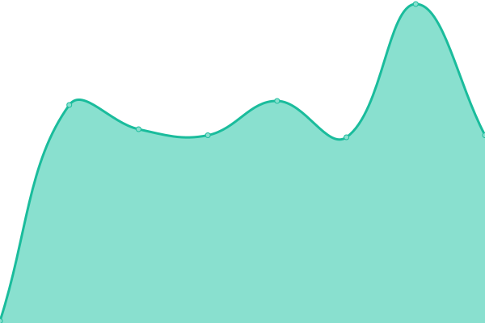
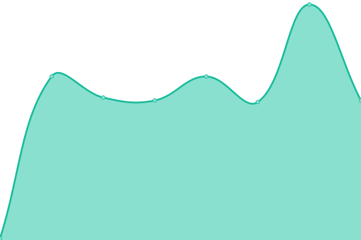
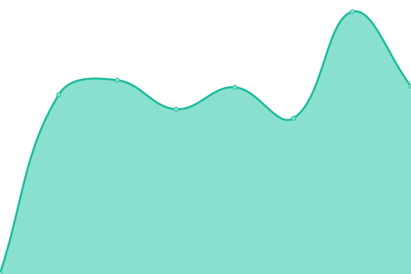

# [📈 Live Status](https://Tergology.github.io/infra-upptime): <!--live status--> **🟩 All systems operational**

This repository contains the open-source uptime monitor and status page for [Tergology](http://tergology.com), powered by [Upptime](https://github.com/upptime/upptime).

With [Upptime](https://upptime.js.org), you can get your own unlimited and free uptime monitor and status page, powered entirely by a GitHub repository. We use [Issues](https://github.com/Tergology/infra-upptime/issues) as incident reports, [Actions](https://github.com/Tergology/infra-upptime/actions) as uptime monitors, and [Pages](https://Tergology.github.io/infra-upptime) for the status page.

<!--start: status pages-->
<!-- This summary is generated by Upptime (https://github.com/upptime/upptime) -->
<!-- Do not edit this manually, your changes will be overwritten -->
<!-- prettier-ignore -->
| URL | Status | History | Response Time | Uptime |
| --- | ------ | ------- | ------------- | ------ |
|  Authentication | 🟩 Up | [authentication.yml](https://github.com/Tergology/infra-upptime/commits/HEAD/history/authentication.yml) | 

 948ms
     
 | 

<a href="https://Tergology.github.io/infra-upptime/history/authentication">100.00%</a>
    

|  Cloud | 🟩 Up | [cloud.yml](https://github.com/Tergology/infra-upptime/commits/HEAD/history/cloud.yml) | 

 1028ms
     
 | 

<a href="https://Tergology.github.io/infra-upptime/history/cloud">100.00%</a>
    

|  Code | 🟩 Up | [code.yml](https://github.com/Tergology/infra-upptime/commits/HEAD/history/code.yml) | 

 764ms
     
 | 

<a href="https://Tergology.github.io/infra-upptime/history/code">100.00%</a>
    

|  Mail | 🟩 Up | [mail.yml](https://github.com/Tergology/infra-upptime/commits/HEAD/history/mail.yml) | 

 638ms
     
 | 

<a href="https://Tergology.github.io/infra-upptime/history/mail">100.00%</a>
    

|  Mail - store | 🟩 Up | [mail-store.yml](https://github.com/Tergology/infra-upptime/commits/HEAD/history/mail-store.yml) | 

 148ms
     
 | 

<a href="https://Tergology.github.io/infra-upptime/history/mail-store">100.00%</a>
    

|  Mail - transfer | 🟩 Up | [mail-transfer.yml](https://github.com/Tergology/infra-upptime/commits/HEAD/history/mail-transfer.yml) | 

 148ms
     
 | 

<a href="https://Tergology.github.io/infra-upptime/history/mail-transfer">100.00%</a>
    

|  Meet | 🟩 Up | [meet.yml](https://github.com/Tergology/infra-upptime/commits/HEAD/history/meet.yml) | 

 777ms
     
 | 

<a href="https://Tergology.github.io/infra-upptime/history/meet">100.00%</a>
    

|  Web - openpgpkey | 🟩 Up | [web-openpgpkey.yml](https://github.com/Tergology/infra-upptime/commits/HEAD/history/web-openpgpkey.yml) | 

 631ms
     
 | 

<a href="https://Tergology.github.io/infra-upptime/history/web-openpgpkey">100.00%</a>
    

|  [Web - annakorshun](https://www.annakorshun.com) | 🟩 Up | [web-annakorshun.yml](https://github.com/Tergology/infra-upptime/commits/HEAD/history/web-annakorshun.yml) | 

 983ms
     
 | 

<a href="https://Tergology.github.io/infra-upptime/history/web-annakorshun">100.00%</a>
    

|  [Web - tergology](https://www.tergology.com) | 🟩 Up | [web-tergology.yml](https://github.com/Tergology/infra-upptime/commits/HEAD/history/web-tergology.yml) | 

 873ms
     
 | 

<a href="https://Tergology.github.io/infra-upptime/history/web-tergology">100.00%</a>
    

<!--end: status pages-->

[**Visit our status website →**](https://Tergology.github.io/infra-upptime)

## 📄 License

- Powered by: [Upptime](https://github.com/upptime/upptime)
- Code: [MIT](./LICENSE) © [Anand Chowdhary](https://anandchowdhary.com), supported by [Pabio](https://pabio.com)
- Data in the `./history` directory: [Open Database License](https://opendatacommons.org/licenses/odbl/1-0/)
