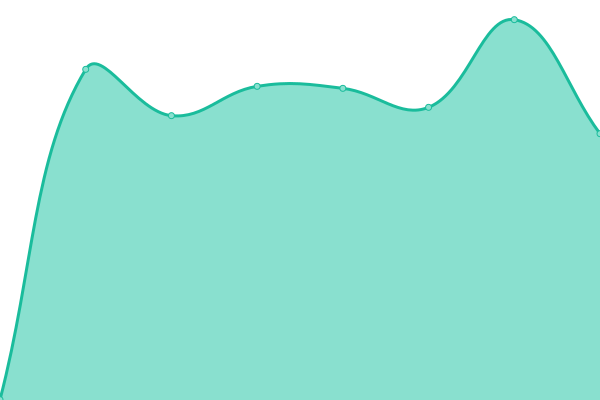

# [📈 Live Status](https://Tergology.github.io/infra-upptime): <!--live status--> **🟥 Complete outage**

This repository contains the open-source uptime monitor and status page for [Tergology](http://tergology.com), powered by [Upptime](https://github.com/upptime/upptime).

With [Upptime](https://upptime.js.org), you can get your own unlimited and free uptime monitor and status page, powered entirely by a GitHub repository. We use [Issues](https://github.com/Tergology/infra-upptime/issues) as incident reports, [Actions](https://github.com/Tergology/infra-upptime/actions) as uptime monitors, and [Pages](https://Tergology.github.io/infra-upptime) for the status page.

<!--start: status pages-->
<!-- This summary is generated by Upptime (https://github.com/upptime/upptime) -->
<!-- Do not edit this manually, your changes will be overwritten -->
<!-- prettier-ignore -->
| URL | Status | History | Response Time | Uptime |
| --- | ------ | ------- | ------------- | ------ |
|  Web - main site | 🟥 Down | [web-main-site.yml](https://github.com/Tergology/infra-upptime/commits/HEAD/history/web-main-site.yml) | 

 0ms
     
 | 

<a href="https://Tergology.github.io/infra-upptime/history/web-main-site">2.34%</a>
    

|  Cloud | 🟥 Down | [cloud.yml](https://github.com/Tergology/infra-upptime/commits/HEAD/history/cloud.yml) | 

 0ms
     
 | 

<a href="https://Tergology.github.io/infra-upptime/history/cloud">0.00%</a>
    

|  Code | 🟥 Down | [code.yml](https://github.com/Tergology/infra-upptime/commits/HEAD/history/code.yml) | 

 0ms
     
 | 

<a href="https://Tergology.github.io/infra-upptime/history/code">0.00%</a>
    

|  Meet - web | 🟥 Down | [meet-web.yml](https://github.com/Tergology/infra-upptime/commits/HEAD/history/meet-web.yml) | 

 0ms
     
 | 

<a href="https://Tergology.github.io/infra-upptime/history/meet-web">4.30%</a>
    

|  Meet - signaling | 🟥 Down | [meet-signaling.yml](https://github.com/Tergology/infra-upptime/commits/HEAD/history/meet-signaling.yml) | 

 0ms
     
 | 

<a href="https://Tergology.github.io/infra-upptime/history/meet-signaling">0.00%</a>
    

|  Meet - streaming | 🟥 Down | [meet-streaming.yml](https://github.com/Tergology/infra-upptime/commits/HEAD/history/meet-streaming.yml) | 

 0ms
     
 | 

<a href="https://Tergology.github.io/infra-upptime/history/meet-streaming">0.00%</a>
    

|  Mail - web | 🟥 Down | [mail-web.yml](https://github.com/Tergology/infra-upptime/commits/HEAD/history/mail-web.yml) | 

 0ms
     
 | 

<a href="https://Tergology.github.io/infra-upptime/history/mail-web">0.00%</a>
    

|  Mail - boxes | 🟥 Down | [mail-boxes.yml](https://github.com/Tergology/infra-upptime/commits/HEAD/history/mail-boxes.yml) | 

 0ms
     
 | 

<a href="https://Tergology.github.io/infra-upptime/history/mail-boxes">0.00%</a>
    

|  Mail - transfer | 🟥 Down | [mail-transfer.yml](https://github.com/Tergology/infra-upptime/commits/HEAD/history/mail-transfer.yml) | 

 0ms
     
 | 

<a href="https://Tergology.github.io/infra-upptime/history/mail-transfer">0.00%</a>
    

|  Mine - test | 🟥 Down | [mine-test.yml](https://github.com/Tergology/infra-upptime/commits/HEAD/history/mine-test.yml) | 

 0ms
     
 | 

<a href="https://Tergology.github.io/infra-upptime/history/mine-test">7.44%</a>
    

<!--end: status pages-->

[**Visit our status website →**](https://Tergology.github.io/infra-upptime)

## 📄 License

- Powered by: [Upptime](https://github.com/upptime/upptime)
- Code: [MIT](./LICENSE) © [Anand Chowdhary](https://anandchowdhary.com), supported by [Pabio](https://pabio.com)
- Data in the `./history` directory: [Open Database License](https://opendatacommons.org/licenses/odbl/1-0/)
